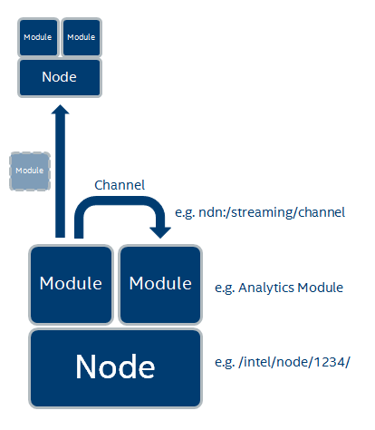
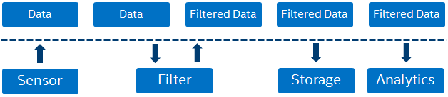
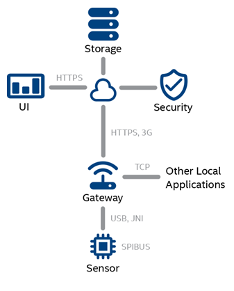
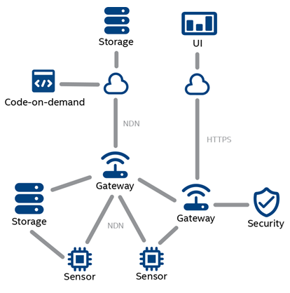

Information-Centric Edge Compute Platform (ICECP)
=================================================

The Information-Centric Edge Compute Platorm (ICECP) is a modular, distributed
application framework to build products for the Internet-of-Things market that
acquire, route, process and store large quantities of IoT related data;
perpetually analyzing incoming information and generating new knowledge by
correlating it with past results. It allows to connect vast numbers of sensors,
hubs, and platform nodes to exchange information locally at the edge and with
the cloud. 
 
Unlike traditional IoT frameworks that primarily collect data or process them
only minimally at the edge, ICECP is aimed to be the platform infrastructure of
choice for "Software-defined Internet of Things" where algorithms and data can
be freely moved around within a deployment to optimize performance, TCO and
other factors.

### Installation and Use

 - [How to Install and Run](https://github.com/icecp/icecp/wiki/How-to-Install-and-Run)

### Documentation

 - [Wiki](https://github.com/icecp/icecp/wiki)
 - [Javadoc](https://icecp.github.io/icecp)

### Structure

The overall structure of the application is divided into three parts: 

  1. `core`, packages for APIs and classes common to all node implementations
  2. `node`, the default icecp-node implementation
  3. `main`, the classes necessary for running a node as a stand-alone
application

Other packages exist at this level (e.g. command, window_buffer) but are not
necessary for node operation and they may be removed from the project with
little notice

### Architecture Overview

ICECP has a __node__ as its central resource; __nodes__ may be sensors,
gateways, servers--any processing unit that can run this application. __Nodes__
contain and run __modules__, that is, sandboxed blocks of code that communicate
with each other and remote modules using __channels__ (see [How To Write Modules]
(doc/modules.md)). In general, __channels__
operate according to a pub-sub model, allowing modules to `publish()` messages
and wait for messages asynchronously using `subscribe(callback)`; one
difference with traditional pub-sub models is that __channels__ also have a
`latest()` method to retrieve only the last published message on the channel.
__Channels__ may be implemented on different transport mechanisms and are
identified by URIs; for example, an NDN channel might look like
`ndn:/name/of/channel`.

A few notes:
 - nodes create and manage channels for modules
 - modules are sandboxed using permissions--retrieved using channels
 - modules can also be loaded using channels
 - messages are passed from module to module and transformed; since the flow
   of information is not coupled to request-response links between two nodes, 
   conceptually we can write modules as if they operate on a streaming message
   bus

### System Overview

In common edge-to-cloud data flows (including several of our past projects), the
data is pushed from the edge to the cloud using one link per edge node; this 
"stove pipe" model is depicted below:

Using ICECP, applications will be able to share network links, retrieve code on demand
from various sources, and overcome intermittent connectivity; NDN also adds
the advantages of in-network caching and application-controlled routing. The
following example is now possible:

### License

Copyright &copy; 2016, Intel Corporation 

Licensed under the Apache License, Version 2.0 (the "License");
you may not use this file except in compliance with the License.
You may obtain a copy of the License at [http://www.apache.org/licenses/LICENSE-2.0](http://www.apache.org/licenses/LICENSE-2.0).

Unless required by applicable law or agreed to in writing, software
distributed under the License is distributed on an "AS IS" BASIS,
WITHOUT WARRANTIES OR CONDITIONS OF ANY KIND, either express or implied.
See the License for the specific language governing permissions and
limitations under the License.
